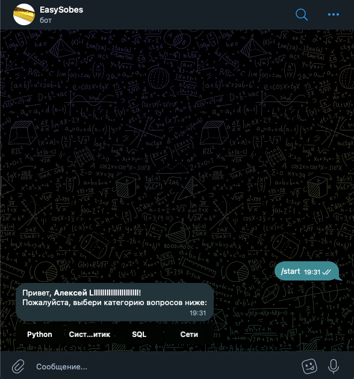
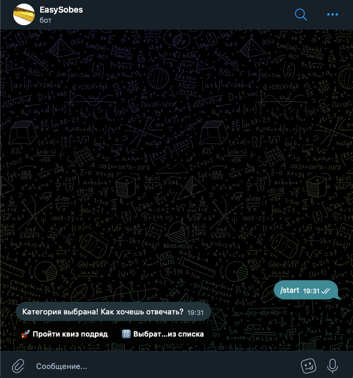
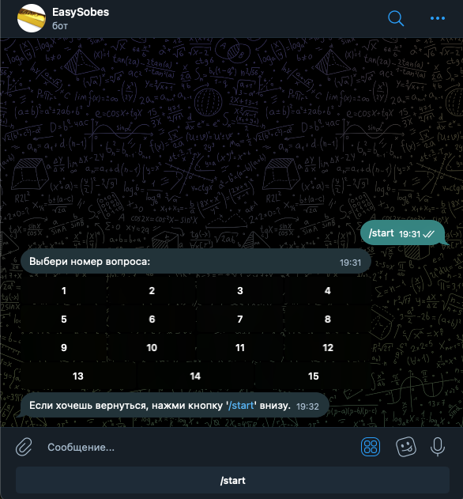
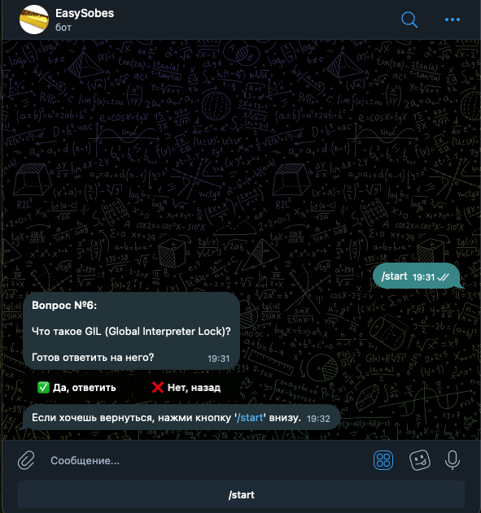
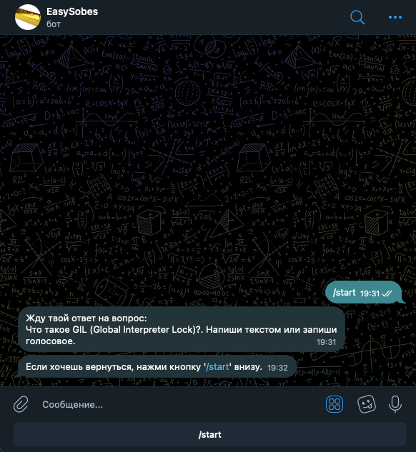
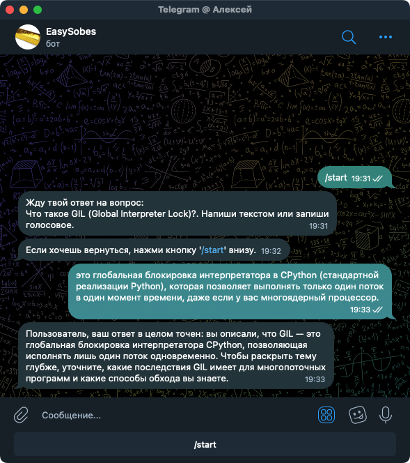

# 🤖 AI Tech Interviewer Bot

Асинхронный Telegram-бот для автоматизированного проведения технических собеседований. Бот использует AI для оценки ответов кандидата, поддерживает голосовой ввод и умеет задавать наводящие вопросы в реальном времени, если ответ неполный.

## Что делает проект?

* **Умное тестирование:** Проводит квизы по различным категориям (SQL, Python и др.).
* **Voice-to-Text:** Принимает ответы голосовыми сообщениями и транскрибирует их с высокой точностью. Использует модель "nova-3" от Deepgram.
* **LLM-Оценка:** Анализирует ответ пользователя с помощью нейросетей, сравнивает с эталоном и дает развернутый фидбек. Используется модель gpt-oss-120b от Groq
* **Адаптивные сценарии (FSM):** При неполном ответе переводит пользователя в состояние follow-up, задавая до 3 уточняющих вопросов.
* **REST API Интеграция:** Позволяет загружать новые пачки вопросов в формате JSON.

##  Архитектура и как это работает

Проект спроектирован с упором на отказоустойчивость, высокую производительность и готовность к production-нагрузкам.

1.  **Связка FastAPI + Aiogram:** Бот работает не на медленном Long Polling, а на **Webhooks**. FastAPI поднимает сервер, который мгновенно принимает POST-запросы от серверов Telegram и передает их в диспетчер Aiogram.
2.  **Асинхронное ядро:** Вся работа с базой данных (SQLAlchemy) и внешними API (LLM, STT) выполняется полностью асинхронно, не блокируя Event Loop.
3.  **Dependency Injection:** Передача сессий БД и конфигураций в хендлеры реализована через middleware, что делает код чистым и легко тестируемым.

##  Технологический стек

* **Backend:** Python, FastAPI, Aiogram 3.x
* **База данных:** PostgreSQL, SQLAlchemy (Async), Alembic (миграции)
* **AI / ML:** LangChain, Deepgram API (для распознавания речи)
* **Инфраструктура:** Docker, Docker Compose

##  Деплой и Инфраструктура (Production)

Проект развернут на VPS с использованием современного подхода к оркестрации:

* **Dokploy (PaaS):** Используется для CI/CD и управления жизненным циклом контейнеров. При пуше в главную ветку происходит автоматическая пересборка и обновление сервиса (Zero-Downtime Deployment).
* **Traefik (Reverse Proxy):** Выступает в роли пограничного шлюза. Автоматически маршрутизирует трафик к контейнерам и управляет **Let's Encrypt SSL-сертификатами**, что критически важно для безопасной работы Webhooks от Telegram.

---
<h3 align="center"> Интерфейс бота</h3>

  
  
  

  
  
  

